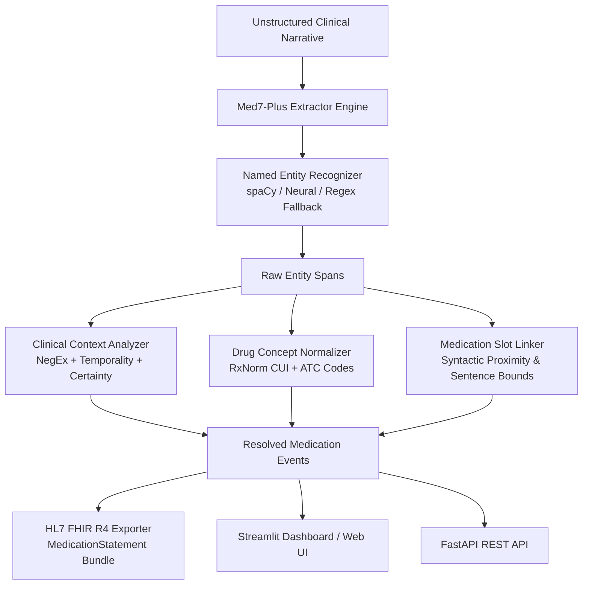

# 🏥 Med7-Plus: Clinical Information Extraction & Medication NER System

[](https://www.python.org/)
[](https://spacy.io/)
[](https://fastapi.tiangolo.com/)
[](https://streamlit.io/)
[](LICENSE)
[]()

> **A Next-Generation Clinical Natural Language Processing & Medication Extraction System.**  
> Built upon the foundational research of **Med7** (*Kormilitzin et al., Artificial Intelligence in Medicine, 2021*), upgraded with **Medication Slot Linking**, **NegEx Clinical Context Extraction (n2c2 2022)**, **RxNorm Drug Normalization**, and **HL7 FHIR R4 Interoperability**.

---

## 📌 Table of Contents
- [Overview](#-overview)
- [Original Med7 vs. Med7-Plus](#-original-med7-vs-med7-plus)
- [System Architecture](#-system-architecture)
- [Supported Clinical Entities](#-supported-clinical-entities)
- [Quick Start](#-quick-start)
- [Interactive Streamlit Web Dashboard](#-interactive-streamlit-web-dashboard)
- [FastAPI Microservice (REST API)](#-fastapi-microservice-rest-api)
- [Evaluation: Strict vs. Lenient F1](#-evaluation-strict-vs-lenient-f1)
- [Working with Real Clinical Datasets (MIMIC-IV / n2c2)](#-working-with-real-clinical-datasets)
- [Educational Tutorial Notebook](#-educational-tutorial-notebook)
- [Project Directory Structure](#-project-directory-structure)
- [Citation & References](#-citation--references)

---

## 🔬 Overview

Electronic Health Records (EHR) contain invaluable patient histories, but **over 80% of actionable clinical information is buried in unstructured clinical notes** (discharge summaries, progress notes, ICU logs).

In 2021, Andrey Kormilitzin, Nemanja Vaci, Qiang Liu, and Alejo Nevado-Holgado introduced **Med7**, a clinical NLP model pre-trained on **2 million free-text patient notes from the MIMIC-III database** and fine-tuned on the 2018 n2c2 challenge to extract seven medication categories.

**Med7-Plus** bridges the gap between research and clinical production:
1. **Medication Slot Linking**: Resolves which strength, route, and frequency belong to which drug.
2. **Context & Negation Analysis**: Detects whether a medication is active, discontinued, or denied (using rules inspired by NegEx and the 2022 n2c2 Track 1 CMED challenge).
3. **RxNorm Normalization**: Resolves free-text drug strings into standardized RxNorm CUIs and ATC codes.
4. **Health IT Interoperability**: Formats extracted prescriptions into standard **HL7 FHIR R4 MedicationStatement** JSON resources.
5. **Zero-Credential Out-of-the-Box Execution**: Includes a synthetic clinical test corpus so anyone can clone and run the system immediately without waiting for hospital data access.

---

## ⚖️ Original Med7 vs. Med7-Plus

| Feature | Original Med7 (2021) | Med7-Plus (This Project) |
| :--- | :--- | :--- |
| **Pre-training Corpus** | MIMIC-III (2001–2012) | MIMIC-III + MIMIC-IV-Note & n2c2 2022 Adapters |
| **Extracted Entities** | 7 isolated categories | 7 Core + Indication + Adverse Effects |
| **Relation Linking** | ❌ None (isolated spans only) | ✅ **Full Slot Linking** (Binds dose/route/freq to Drug) |
| **Negation Detection** | ❌ None | ✅ **NegEx Context** (Active vs. Discontinued/Denied) |
| **Certainty & Temporality** | ❌ None | ✅ PRN/Conditional vs Confirmed (n2c2 CMED) |
| **Drug Normalization** | ❌ Raw text only | ✅ **RxNorm CUI & ATC Class Mapping** |
| **Health IT Export** | ❌ None | ✅ **HL7 FHIR R4 MedicationStatement Bundles** |
| **Interactive UI** | ❌ None | ✅ **Streamlit Dashboard** + DisplaCy markup |
| **Production Serving** | ❌ Python library only | ✅ **FastAPI REST Endpoint** with Swagger UI |
| **Evaluation Metrics** | Lenient & Strict F1 | Built-in Automated Strict/Lenient Evaluator |

---

## 🏗️ System Architecture



---

## 🏷️ Supported Clinical Entities

Med7-Plus identifies the 7 core Med7 categories plus modern clinical extensions:

| Entity Label | Description | Example in Clinical Text |
| :--- | :--- | :--- |
| **`DRUG`** | Medication or pharmaceutical brand/generic name | *Metformin*, *Lisinopril*, *Furosemide* |
| **`STRENGTH`** | Potency or concentration of the active substance | *500 mg*, *40 mg*, *18 units/kg/hr* |
| **`DOSAGE`** | Number of units administered | *1 tablet*, *2 puffs*, *1 vial* |
| **`ROUTE`** | Method of administration | *PO*, *oral*, *IV*, *subcutaneous* |
| **`FREQUENCY`** | Scheduling or administration intervals | *once daily*, *BID*, *q12h*, *PRN* |
| **`DURATION`** | Length of the treatment course | *for 14 days*, *x 4 weeks* |
| **`FORM`** | Physical pharmaceutical formulation | *tablet*, *capsule*, *solution*, *cream* |
| **`INDICATION`** | Documented therapeutic rationale | *for hypertension*, *for acute pain* |
| **`ADVERSE_EFFECT`**| Reported adverse reaction or drug allergy | *severe cough*, *rash*, *anaphylaxis* |

---

## 🚀 Quick Start

### 1. Clone & Set Up Environment
```bash
git clone https://github.com/your-username/med7-clinical-extraction.git
cd med7-clinical-extraction

# Create virtual environment
python -m venv venv
source venv/bin/activate  # On Windows: .\venv\Scripts\activate

# Install dependencies
pip install -r requirements.txt
```

### 2. Run Instant CLI Demo
```bash
python demo.py
```
This runs extraction on a sample multi-drug patient narrative and outputs:
- Colored token spans
- Resolved drug slot records
- Active vs. Discontinued medication status
- Generated HL7 FHIR JSON payload

### 3. Run Test Suite
```bash
python -m unittest discover tests
```

---

## 🎨 Interactive Streamlit Web Dashboard

Med7-Plus includes a Streamlit interface featuring:
- Real-time clinical text editing with pre-loaded clinical scenarios
- DisplaCy-style highlighted medical entity markup
- Tabulated medication resolution with RxNorm codes
- 1-click JSON and FHIR bundle inspection

Launch the web app:
```bash
streamlit run web_app/app_streamlit.py
```
Visit `http://localhost:8501` in your browser.

---

## ⚡ FastAPI Microservice (REST API)

Deploy Med7-Plus as a production-grade asynchronous REST API:

```bash
uvicorn web_app.api:app --host 0.0.0.0 --port 8000 --reload
```

Interactive Swagger documentation is automatically available at:
👉 **`http://localhost:8000/docs`**

### Sample API Request
```bash
curl -X POST "http://localhost:8000/extract" \
     -H "Content-Type: application/json" \
     -d '{
       "text": "Initiate Metformin 500 mg PO BID with meals. Discontinued Lisinopril."
     }'
```

---

## 📊 Evaluation: Strict vs. Lenient F1

Clinical NLP follows specialized evaluation criteria established in the **i2b2/n2c2** challenges and utilized in the original Med7 paper:

- **Strict F1**: An entity prediction is counted as a True Positive **only if both the label and exact start/end character offsets match identically**.
- **Lenient F1**: An entity prediction is counted as a True Positive if the **label matches and the predicted span overlaps by at least one character** with the gold span.

In clinical practice, Lenient F1 reflects true clinical utility: recognizing *`Metoprolol`* instead of *`Metoprolol succinate`* still extracts the correct underlying drug concept.

Med7-Plus provides an automated evaluator:
```python
from med7_plus.evaluator import ClinicalEvaluator

evaluator = ClinicalEvaluator()
metrics = evaluator.evaluate(gold_annotations, pred_annotations)

print(f"Strict  F1: {metrics['micro_strict']['f1']}")
print(f"Lenient F1: {metrics['micro_lenient']['f1']}")
```

---

## 🗄️ Working with Real Clinical Datasets

If you have credentialed access to medical data, Med7-Plus includes pre-processing adapters:

### MIMIC-IV / MIMIC-III (PhysioNet)
1. Request access on [PhysioNet MIMIC-IV](https://physionet.org/content/mimiciv/).
2. Download `discharge.csv.gz` (MIMIC-IV-Note) or `NOTEEVENTS.csv` (MIMIC-III).
3. Convert to training format:
   ```bash
   python scripts/convert_mimic.py --input data/raw/discharge.csv --output data/processed/mimic_notes.json
   ```

### n2c2 2018 / 2022 CMED (Harvard Medical School)
1. Request access via the [Harvard DBMI n2c2 portal](https://n2c2.dbmi.hms.harvard.edu/).
2. Convert `.ann` (Brat standoff) annotations into JSON training format:
   ```bash
   python scripts/convert_n2c2.py --input-dir data/raw/n2c2_2022/ --output data/processed/n2c2_dataset.json
   ```

### Training Your Own spaCy Model
```bash
python scripts/train_spacy_ner.py --data data/sample/synthetic_ehr_notes.json --epochs 20
```

---

## 📓 Educational Tutorial Notebook

A comprehensive Jupyter Notebook is included at [`notebooks/01_clinical_ner_tutorial.ipynb`](notebooks/01_clinical_ner_tutorial.ipynb) to walk you through:
1. Why EHR narratives are uniquely difficult for standard NLP.
2. The transfer learning paradigm from MIMIC-III to clinical target domains.
3. How to implement clinical slot linking.
4. Calculating Precision, Recall, and F1 under lenient vs strict matching.
5. Exporting to FHIR R4.

---

## 📁 Project Directory Structure

```
med7-clinical-extraction/
├── .github/
│   └── workflows/
│       └── ci.yml                 # Automated multi-version CI testing
├── data/
│   ├── sample/
│   │   └── synthetic_ehr_notes.json # 5+ rich pre-annotated gold clinical notes
│   ├── raw/
│   │   └── README.md              # HIPAA & PhysioNet credentialing guidelines
│   └── processed/                 # Converted dataset storage
├── med7_plus/
│   ├── __init__.py                # Package root
│   ├── config.py                  # Entity definitions, colors, clinical triggers
│   ├── extractor.py               # Main pipeline (spaCy neural + regex fallback)
│   ├── context_analyzer.py        # NegEx negation & certainty classification
│   ├── relation_linker.py         # Medication slot relation extractor
│   ├── normalizer.py              # RxNorm CUI and ATC code lookup
│   ├── evaluator.py               # Strict & Lenient clinical F1 metrics
│   └── fhir_exporter.py           # HL7 FHIR R4 MedicationStatement generator
├── scripts/
│   ├── convert_mimic.py           # MIMIC-III and MIMIC-IV discharge note parser
│   ├── convert_n2c2.py            # n2c2 Brat .ann standoff parser
│   └── train_spacy_ner.py         # spaCy clinical NER training workflow
├── web_app/
│   ├── app_streamlit.py           # Interactive Streamlit dashboard
│   └── api.py                     # Production FastAPI REST microservice
├── notebooks/
│   └── 01_clinical_ner_tutorial.ipynb # Educational step-by-step tutorial
├── tests/
│   ├── test_extractor.py          # Pipeline extraction unit tests
│   ├── test_context_analyzer.py   # Negation & certainty unit tests
│   └── test_evaluator.py          # Strict vs Lenient metric tests
├── demo.py                        # Standalone 1-click CLI demonstration
├── Dockerfile                     # Container deployment image
├── requirements.txt               # Production Python dependencies
├── pyproject.toml                 # Modern package metadata
├── LICENSE                        # MIT License
└── README.md                      # Project documentation
```

---

## 📚 Citation & References

If you use or build upon this system, please cite the foundational Med7 paper:

```bibtex
@article{kormilitzin2021med7,
  title={Med7: a transferable clinical natural language processing model for electronic health records},
  author={Kormilitzin, Andrey and Vaci, Nemanja and Liu, Qiang and Nevado-Holgado, Alejo},
  journal={Artificial Intelligence in Medicine},
  volume={118},
  pages={102086},
  year={2021},
  publisher={Elsevier},
  doi={10.1016/j.artmed.2021.102086}
}
```

### Additional References
- **n2c2 2018 Track 2**: Adverse Drug Events and Medication Extraction shared task.
- **n2c2 2022 Track 1**: Contextualized Medication Event Dataset (CMED).
- **MIMIC-IV**: Johnson, A. et al. (2023). MIMIC-IV-Note: De-identified free-text clinical notes. *PhysioNet*.
- **HL7 FHIR R4**: [MedicationStatement Resource Specification](https://hl7.org/fhir/R4/medicationstatement.html).

---

## 📄 License
This project is licensed under the [MIT License](LICENSE).
